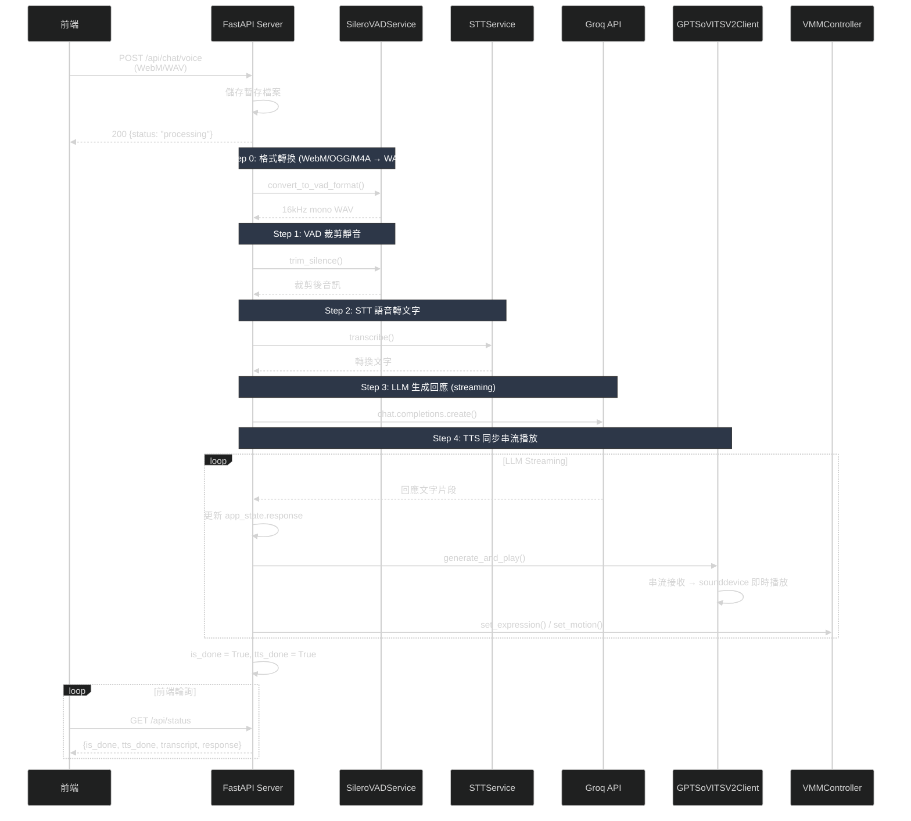
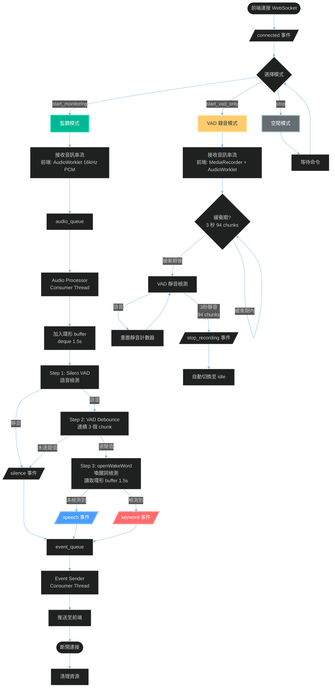

# 📋 Callisto 語音助理後端服務

> 基於 VAD + KWS 的智能語音對話系統  
> Version: 0.2.0 | Updated: 2026-03-04

## 🎯 系統概述

Callisto 是一個智能語音助理後端服務，整合了語音活動檢測（VAD）、喚醒詞檢測（KWS）、語音轉文字（STT）、大型語言模型（LLM）和文字轉語音（TTS）等技術，並透過 VMagicMirror 控制虛擬形象，提供完整的語音對話體驗。

**核心特性**：
- 🎤 **即時語音監聽**: WebSocket 即時音訊流處理
- 🔊 **喚醒詞檢測**: 支援自訂喚醒詞（openWakeWord）
- 💬 **智能對話**: 基於 Groq LLM 的自然對話
- 🎵 **同步串流 TTS**: GPT-SoVITS V2 串流生成並即時播放
- 🎭 **虛擬形象控制**: OSC → VMagicMirror → VRM 3D 模型
- 🔄 **雙模式支援**: HTTP API + WebSocket 雙介面

---

## 🛠️ 技術棧

### 核心框架
- **FastAPI** 0.128.0+ - 現代 Web 框架
- **Uvicorn** - ASGI 伺服器
- **WebSockets** 16.0+ - 即時通訊

### 語音處理技術
| 技術 | 用途 | 實現 |
|------|------|------|
| **VAD** | 語音活動檢測（含 AGC） | Silero VAD (ONNX Runtime) |
| **KWS** | 喚醒詞檢測 | openWakeWord |
| **STT** | 語音轉文字 | faster-whisper |
| **LLM** | 對話生成 | Groq API |
| **TTS** | 文字轉語音（串流） | GPT-SoVITS V2 |
| **VMM** | 虛擬形象控制 | pythonosc → VMagicMirror |

### 音訊處理
- **SoundDevice** - 音訊串流播放
- **SoundFile** - 音訊檔案處理
- **Pydub** - 音訊格式轉換
- **NumPy** + **SciPy** - 訊號處理

### 依賴套件
完整套件清單請參考 [pyproject.toml](pyproject.toml)

---

##  系統架構

### HTTP API 語音對話流程



### WebSocket 即時監聽流程



---

## 🔌 API 端點

### 1. POST /api/chat/text

直接傳入文字訊息觸發對話管線（調試用）。

**端點**: `POST /api/chat/text`

**Query 參數**:

| 參數 | 類型 | 必填 | 說明 |
|------|------|------|------|
| text | string | ✅ | 使用者輸入文字 |

**Response**: `UploadResponse`

```json
{
  "status": "processing",
  "message": "User: ...\nAssistant: ..."
}
```

> `message` 欄位回傳當前對話記憶快取內容（`memory_cache.show_history()`），方便直接確認 pipeline 是否正常運作。

**使用範例**:
```bash
curl -X POST "http://localhost:8000/api/chat/text?text=你好"
```

---

### 2. POST /api/chat/voice

上傳語音檔案並啟動對話處理（背景任務）。

**端點**: `POST /api/chat/voice`

**Content-Type**: `multipart/form-data`

**Request 參數**:

| 參數 | 類型 | 必填 | 說明 |
|------|------|------|------|
| audio | File | ✅ | 音訊檔案 (WAV/WebM/OGG/M4A) |

**Response**: `UploadResponse`

```json
{
  "status": "processing",
  "message": "音訊已接收，正在處理中..."
}
```

**錯誤碼**:
- `400` - 無效的檔案類型
- `409` - 正在處理中，請稍後再試
- `500` - 伺服器錯誤

**使用範例**:

```bash
curl -X POST http://localhost:8000/api/chat/voice \
  -F "audio=@test.wav"
```

---

### 3. GET /api/status

查詢當前處理狀態。

**端點**: `GET /api/status`

**Response**: `StatusResponse`

```json
{
  "is_done": true,
  "transcript": "使用者說的話",
  "response": "AI 回應的內容",
  "error": null,
  "tts_done": true
}
```

**欄位說明**:

| 欄位 | 類型 | 說明 |
|------|------|------|
| is_done | boolean | 整個 pipeline（STT+LLM+TTS）是否完成 |
| transcript | string | STT 轉換的文字 |
| response | string | LLM 生成的回應 |
| error | string\|null | 錯誤訊息 |
| tts_done | boolean | TTS 播放是否完成（True = 未播放中） |

**使用範例**:

```python
import requests, time

while True:
    data = requests.get("http://localhost:8000/api/status").json()
    if data["is_done"] and data["tts_done"]:
        print(f"轉換文字: {data['transcript']}")
        print(f"AI 回應: {data['response']}")
        break
    time.sleep(0.5)
```

---

### 4. GET /

健康檢查端點，回傳各外部服務連線狀態與目前處理狀態。

**端點**: `GET /`

**Response**:

```json
{
  "status": "ok",
  "message": "Callisto Voice API is running",
  "services": {
    "groq": {
      "status": "connected",
      "available_models": 15,
      "using_model": "llama-3.1-8b-instant"
    },
    "tts": {
      "status": "connected",
      "url": "http://localhost:9880"
    },
    "stt": {
      "status": "loaded",
      "model": "faster-whisper medium (int8) on cpu"
    }
  },
  "processing": {
    "is_done": true,
    "has_error": false,
    "status": "idle"
  }
}
```

> `status` 為 `"ok"` 表示所有服務正常；-`"degraded"` 表示部分服務異常但仍可運行。

---

### 5. WebSocket /ws/voice-monitor

即時語音監聽端點，支援 VAD + KWS 並行檢測。

**端點**: `WebSocket /ws/voice-monitor`

**連接**: `ws://localhost:8000/ws/voice-monitor`

#### 接收資料格式

**音訊串流** (binary):
- 格式: PCM
- 位深: 16-bit signed integer
- 採樣率: 16000 Hz
- 聲道: 單聲道 (mono)

**命令** (JSON text):

```json
// 切換至監聽模式 (VAD + KWS)
{"type": "start_monitoring"}

// 切換至 VAD 錄音模式 (僅 VAD)
{"type": "start_vad_only"}

// 停止監聽
{"type": "stop"}
```

#### 發送事件格式

**連接成功**:
```json
{
  "type": "connected",
  "timestamp": 1737609600.123,
  "message": "WebSocket 連接已建立"
}
```

**檢測到語音**:
```json
{
  "type": "speech",
  "duration": 1.5,
  "timestamp": 1737609601.456
}
```

**檢測到喚醒詞**:
```json
{
  "type": "keyword",
  "keyword": "hey_jarvis",
  "confidence": 0.85,
  "timestamp": 1737609602.789
}
```

**VAD 檢測到靜音停止** (vad_only 模式):
```json
{
  "type": "stop_recording",
  "reason": "silence_detected",
  "silence_duration": 3.0,
  "timestamp": 1737609605.012
}
```

**錯誤訊息**:
```json
{
  "type": "error",
  "message": "錯誤描述"
}
```

#### 使用範例

```javascript
// JavaScript (前端)
const ws = new WebSocket('ws://localhost:8000/ws/voice-monitor');

// 連接建立
ws.onopen = () => {
  console.log('WebSocket 已連接');
  
  // 切換至監聽模式
  ws.send(JSON.stringify({type: 'start_monitoring'}));
  
  // 開始發送音訊流
  navigator.mediaDevices.getUserMedia({ audio: true })
    .then(stream => {
      const audioContext = new AudioContext({sampleRate: 16000});
      const source = audioContext.createMediaStreamSource(stream);
      const processor = audioContext.createScriptProcessor(512, 1, 1);
      
      processor.onaudioprocess = (e) => {
        const pcmData = e.inputBuffer.getChannelData(0);
        const int16Data = new Int16Array(pcmData.length);
        for (let i = 0; i < pcmData.length; i++) {
          int16Data[i] = Math.max(-32768, Math.min(32767, pcmData[i] * 32768));
        }
        ws.send(int16Data.buffer);
      };
      
      source.connect(processor);
      processor.connect(audioContext.destination);
    });
};

// 接收事件
ws.onmessage = (event) => {
  const data = JSON.parse(event.data);
  
  switch (data.type) {
    case 'keyword':
      console.log(`檢測到喚醒詞: ${data.keyword} (${data.confidence})`);
      break;
    case 'speech':
      console.log('檢測到語音');
      break;
    case 'stop_recording':
      console.log('VAD 檢測到靜音，停止錄音');
      break;
  }
};
```

---

## 🎯 核心服務模組

### VoiceChatService

**檔案**: `services/core/voice_chat_service.py`

**功能**: 語音對話主服務，串聯完整 pipeline

**處理流程**:
1. 音訊格式轉換為 VAD 格式 (16kHz mono WAV)
2. VAD 裁剪靜音 (Silero VAD)
3. STT 語音轉文字 (faster-whisper)
4. Groq LLM 生成回應 (streaming)
5. TTS 串流生成與直接播放 (GPT-SoVITS V2 + sounddevice)
6. VMMController 同步表情動作

**依賴服務**:
- `SileroVADService` - VAD 處理
- `STTService` - 語音轉文字
- `Groq API` - LLM 對話生成
- `GPTSoVITSV2Client` - TTS 串流生成與播放
- `VMMController` - 虛擬形象動作控制
- `MemoryCache` - 對話記憶快取

**狀態管理**: `AppState`
- `is_done`: 整個 pipeline 是否完成
- `transcript`: STT 轉換文字
- `response`: LLM 生成回應
- `error`: 錯誤訊息
- `tts_done`: TTS 播放是否完成

---

### VoiceMonitorWebSocketService

**檔案**: `services/monitoring/voice_monitor_websocket_service.py`

**功能**: WebSocket 音訊監聽服務

**架構**: Producer-Consumer 模式
- **Producer**: 接收前端音訊串流，放入 `audio_queue`
- **Consumer 1**: `_audio_processor` 處理音訊，將事件放入 `event_queue`
- **Consumer 2**: `_event_sender` 發送事件至前端

**支援模式**:
- `monitoring` - VAD + KWS 並行檢測
- `vad_only` - 僅 VAD 檢測（錄音模式）
- `idle` - 空閒模式

**特性**:
- 非阻塞音訊處理
- 模式動態切換
- VAD 緩衝期機制 (避免誤觸發)
- 3 秒靜音自動停止

---

### AudioMonitorService

**檔案**: `services/monitoring/audio_monitor_service.py`

**功能**: VAD + KWS 協調服務

**檢測機制**:
- **VAD (Silero)**: 作為「驗證器」，確認真實語音
- **KWS (openWakeWord)**: 並行運行，檢測喚醒詞

**技術細節**:
- **環形緩衝區**: 保留最近 1.5 秒音訊
- **VAD Debounce**: 連續 3 個 chunk 才確認語音
- **KWS Cooldown**: 1 秒內忽略重複檢測

**統計資訊**:
- `total_chunks`: 總處理數
- `speech_chunks`: 語音塊數
- `keywords_detected`: 喚醒詞次數
- `cooldown_ignored`: Cooldown 忽略次數

---

### STTService

**檔案**: `services/audio_processing/stt_service.py`

**功能**: 語音轉文字服務

**技術**: faster-whisper

**特性**:
- CUDA Fallback 機制（自動偵測 GPU）
- 繁體中文優化 prompt
- Beam search (beam_size=5)

**API**:
```python
transcribe(audio_path, language="zh", beam_size=5) -> str
```

---

### GPTSoVITSV2Client

**檔案**: `services/audio_processing/gpt_sovits_service.py`

**功能**: TTS 串流生成與直接播放客戶端

**技術**: GPT-SoVITS V2 API + sounddevice 直接播放

**API 端點**: `http://localhost:9880/tts`

**主要方法**:
```python
# 串流生成並直接播放（同步）
speak(text, language) -> None
```

**注意**: 採用同步串流播放，不使用獨立播放佇列；`VoiceChatService` 在 TTS 播放完成後才將 `tts_done` 設為 `True`。

---

### SileroVADService

**檔案**: `services/audio_processing/silero_vad_service.py`

**功能**: 語音活動檢測與音訊處理

**技術**: Silero VAD (ONNX Runtime)

**主要功能**:
1. **VAD 檢測**: `detect(audio_chunk) -> bool`
2. **靜音裁剪**: `trim_silence(input_path, output_path) -> str`
3. **格式轉換**: `convert_to_vad_format(input_path, output_path)`
   - 支援: WebM, OGG, M4A, WAV 等
   - 輸出: 16kHz mono 16-bit WAV

**閾值**: 預設 0.5 (可調整)

---

### KeywordSpottingService

**檔案**: `services/audio_processing/kws_service.py`

**功能**: 喚醒詞檢測服務

**技術**: openWakeWord

**喚醒詞**: 預設使用 `hey_jarvis` 模型；如需自訂模型，請於 `config.yaml` 中指定模型路徑

**API**:
```python
# 檢測喚醒詞
detect(audio_chunk: bytes) -> Optional[Dict]

# 返回格式
{
  "keyword": "hey_jarvis",
  "confidence": 0.85
}
```

**閾值**: 預設 0.5

---

### VMMController

**檔案**: `services/visual/vmm_service.py`

**功能**: VMagicMirror 虛擬形象控制服務

**通訊**: 透過 HTTP API 發送動作指令至 VMagicMirror

**主要方法**:
```python
# 播放表情
play_expression(expression_name: str) -> None

# 播放動作
play_motion(motion_name: str) -> None
```

---

## ⚙️ 配置說明

### 環境變數

| 變數 | 必填 | 說明 | 範例 |
|------|------|------|------|
| GROQ_API_KEY | ✅ | Groq API 金鑰 | gsk_xxx |

### 系統需求

**硬體**:
- CPU: 任意 (建議多核心)
- RAM: 8GB+ (建議 16GB)
- GPU: 可選 (GTX 1060 6GB 以上)
- VRAM: TTS 佔用 4.5-5GB, Whisper 佔用 ~500MB

**作業系統**:
- Windows 10/11
- Linux (Ubuntu 20.04+)
- macOS (未測試)

**外部服務**:
- GPT-SoVITS V2 Server (`http://localhost:9880`)
- VMagicMirror (`http://localhost:39539`)

---

## ⚠️ 錯誤處理與常見問題

### API 錯誤碼

| HTTP 碼 | 說明 | 解決方法 |
|---------|------|----------|
| 400 | 無效的檔案類型 | 確認上傳音訊格式 (WAV/WebM/OGG/M4A) |
| 409 | 正在處理中 | 等待當前任務完成後再試 |
| 500 | 伺服器錯誤 | 檢查日誌，確認外部服務狀態 |

### 常見問題

**Q: Groq API 連線失敗**
```
A: 檢查 .env 檔案中的 GROQ_API_KEY 是否正確
```

**Q: TTS 服務無法連線**
```
A: 確認 GPT-SoVITS V2 Server 是否在 http://localhost:9880 運行
   curl http://localhost:9880/
```

**Q: STT 轉換失敗**
```
A: 確認音訊檔案格式正確，檢查 faster-whisper 模型是否已下載
```

**Q: WebSocket 連線斷開**
```
A: 檢查前端音訊格式是否為 16kHz mono int16 PCM
   確認網路連線穩定
```

**Q: GPU 記憶體不足**
```
A: 系統已設定 STT 使用 CPU 模式
   TTS 需要 4.5-5GB VRAM，無法降級
```

---

## 🧪 測試範例

### 測試語音上傳

```bash
# 1. 錄製測試音訊（使用系統麥克風）
ffmpeg -f dshow -i audio="麥克風" -t 5 -ar 16000 -ac 1 test.wav

# 2. 上傳測試
curl -X POST http://localhost:8000/api/chat/voice \
  -F "audio=@test.wav"

# 3. 輪詢狀態
while true; do
  curl http://localhost:8000/api/status | jq
  sleep 1
done
```

### 測試 WebSocket

**Python 測試腳本**:

```python
import asyncio
import websockets
import numpy as np

async def test_websocket():
    uri = "ws://localhost:8000/ws/voice-monitor"
    
    async with websockets.connect(uri) as websocket:
        # 接收連接事件
        response = await websocket.recv()
        print(f"連接: {response}")
        
        # 切換至監聽模式
        await websocket.send('{"type": "start_monitoring"}')
        
        # 模擬發送音訊數據
        for i in range(100):
            # 生成隨機音訊塊 (512 samples, 16kHz, int16)
            audio = np.random.randint(-1000, 1000, 512, dtype=np.int16)
            await websocket.send(audio.tobytes())
            await asyncio.sleep(0.032)  # 32ms
            
            # 檢查事件
            try:
                event = await asyncio.wait_for(
                    websocket.recv(),
                    timeout=0.001
                )
                print(f"事件: {event}")
            except asyncio.TimeoutError:
                pass

asyncio.run(test_websocket())
```

---

## 📝 日誌

伺服器會在終端機輸出詳細的處理日誌：

```
2026-03-04 10:00:00 - INFO - 正在啟動 FastAPI 應用...
2026-03-04 10:00:01 - INFO - ✅ STT 服務初始化完成 (CPU 模式)
2026-03-04 10:00:01 - INFO - ✅ GPT-SoVITS V2 TTS 服務就緒
2026-03-04 10:00:01 - INFO - ✅ FastAPI 應用啟動完成
2026-03-04 10:01:00 - INFO - 音訊檔案已儲存: /tmp/voice_20260304_100100.webm
2026-03-04 10:01:01 - INFO - Step 0: 音訊格式轉換
2026-03-04 10:01:02 - INFO - Step 1: VAD 裁剪靜音
2026-03-04 10:01:03 - INFO - Step 2: STT 轉文字
2026-03-04 10:01:05 - INFO - 使用者說: 今天天氣如何？
2026-03-04 10:01:05 - INFO - Step 3: Groq LLM 生成回應
2026-03-04 10:01:07 - INFO - Step 4: TTS 串流生成並播放
2026-03-04 10:01:10 - INFO - AI 回應已生成完成: 今天天氣晴朗，溫度約 25 度...
2026-03-04 10:01:15 - INFO - TTS 播放完成
```

---

## 📚 相關文檔

- [pyproject.toml](pyproject.toml) - 套件依賴清單
- [docs/specs/](../docs/specs/) - 功能規格文檔

---

**Last Updated**: 2026-03-04  
**Version**: 0.2.0  
**Maintained by**: TaiyakiVenturer
